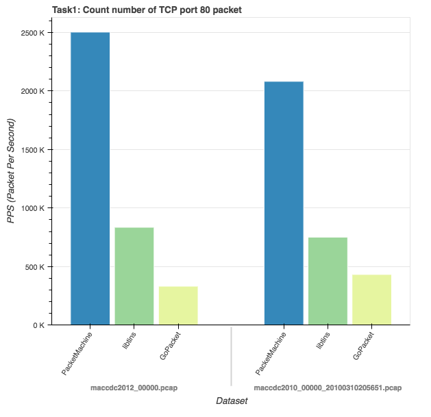
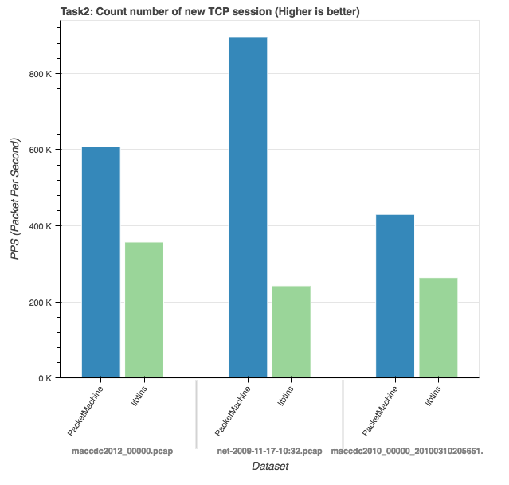
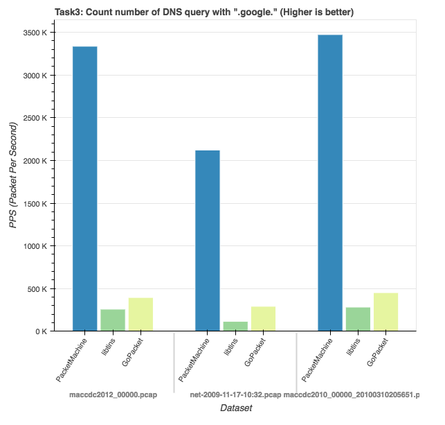

Benchmark
============

These benchmark tests are [here](https://github.com/m-mizutani/packetmachine-benchmark).

Environment
------------

Use MacBook Pro Mid 2012.

- OS: macOS High Sierra ver 10.13.1
- CPU: 2.3 GHz Intel Core i7
- Memory: 16 GB 1600 MHz DDR3
- Disk: Use RAM disk for benchmark

Data set
-----------

Refer [Public PCAP files for download](http://www.netresec.com/?page=PcapFiles) that is provided by [NETRESEC](https://www.netresec.com/).

| Name                                   | Data Size  | Packet count | Average Packet Length |
|:---------------------------------------|-----------:|-------------:|----------------------:|
| `net-2009-11-17-10:32.pcap`            | 289.12 MB  | 332,045      | 854.72 Byte |
| `maccdc2010_00000_20100310205651.pcap` | 925.33 MB  | 10,000,000   | 765.33 Byte |
| `maccdc2012_00000.pcap`                | 1073.67 MB | 8,635,943    | 108.32 Byte |

Results
-----------

### Task #1: Count number of TCP port 80 packet

Source code list of the benchmark test.

- [PacketMachine](https://github.com/m-mizutani/packetmachine-benchmark/blob/master/src/task1/pm.cc)
- [libtins](https://github.com/m-mizutani/packetmachine-benchmark/blob/master/src/task1/tins.cc)
- [GoPacket](https://github.com/m-mizutani/packetmachine-benchmark/blob/master/src/task1/gopkt.go)

### Task #2: Count number of new TCP session

Source code list of the benchmark test.

- [PacketMachine](https://github.com/m-mizutani/packetmachine-benchmark/blob/master/src/task2/pm.cc)
- [libtins](https://github.com/m-mizutani/packetmachine-benchmark/blob/master/src/task2/tins.cc)

### Task #3: Count number of DNS query with ".google."

Source code list of the benchmark test.

- [PacketMachine](https://github.com/m-mizutani/packetmachine-benchmark/blob/master/src/task3/pm.cc)
- [libtins](https://github.com/m-mizutani/packetmachine-benchmark/blob/master/src/task3/tins.cc)
- [GoPacket](https://github.com/m-mizutani/packetmachine-benchmark/blob/master/src/task3/gopkt.go)
