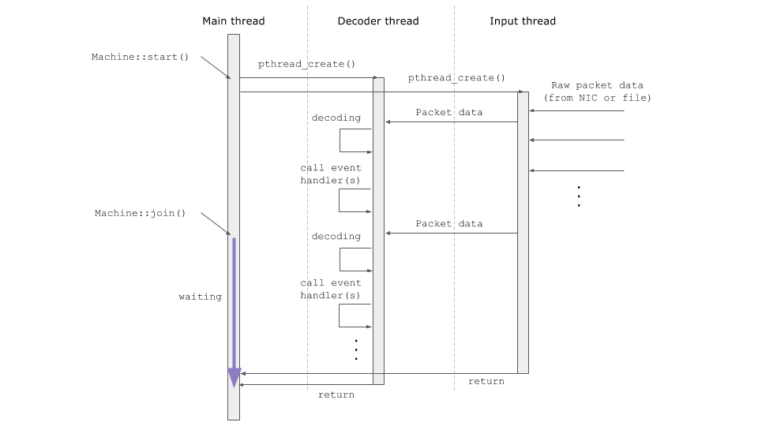

Tutorial of PacketMachine Programming
===========================

Getting Started
------------

```cpp
#include <iostream>
#include <packetmachine.hpp>

int main(int argc, char* argv[]) {
  // Create an instance
  pm::Machine m;

  // Register callback function that shows TCP flow
  m.on("TCP", [](const pm::Property& p) {
      // This function is called in each packet including TCP
      std::cout << "TCP: " <<
	      // p["xxx"] gets parameter from the packet
          p["IPv4.src"] << ":" << p["TCP.src_port"] << " > " <<
          p["IPv4.dst"] << ":" << p["TCP.dst_port"] << std::endl;
    });

  // Add a network device specified by CLI argument as input source
  m.add_pcapdev(argv[1]);
  
  // Start packet capture loop
  m.loop();

  return 0;
}
```

```sh
$ clang++ -std=c++11 example.cc -o example -lpacketmachine
$ sudo ./example eth0
```

Welcome to PacketMachine. If you did not install PacketMachine library, please see a [installation guide](install.md) before writing code. The PacketMachine allows you to write packet capture & analysis programs in C++. A simple example packet capture program is above. The program captures packets from a network interface that is given as 1st argument, and output IPv4 source address, TCP source port, destination addresss and TCP destination port of each TCP packet.

This part of the documentation, which is mostly prose, begins with some background information about PacketMachine, then focuses on step-by-step instructions for getting the most out of PacketMachine.


Case Studies
----------------

- [Add input source to read pcapfile](tutorial.md#input-source)
- [Running in the background](tutorial.md#run-background)
- [Enable/disable/destroy handler](tutorial.md#manage-handler)
- [Use data as various format (integer, byte sequence, etc)](tutorial.md#use-data-format)
- [Access a structured parameter (Array and Map)](tutorial.md#use-struct-parameter)
- [Faster parameter access](tutorial.md#faster-parameter-access)

### [Add input source (pcapfile or device)](#input-source)

```cpp
#include <iostream>
#include <packetmachine.hpp>
#include <unistd.h>

int main(int argc, char* argv[]) {
  pm::Machine m;
  m.on("IPv4", [](const pm::Property& p) {
      std::cout << p["IPv4.src"] << " -> " << p["IPv4.dst"] << std::endl;
  });

  // Add a Pcap (tcpdump) based file as input source
  m.add_pcapfile(argv[1]);

  m.loop();
  return 0;
}
```

PacketMachine supports 2 input sources: Capturing a network traffic via device OR Reading a pcap format file. `pm::Machine::add_pcapdev()` can be used for a network device, and `pm::Machine::add_pcapfile()` can be used for a pcap format file.

### [Running in the background](#run-background)

```cpp
#include <iostream>
#include <packetmachine.hpp>
#include <unistd.h>

int main(int argc, char* argv[]) {
  pm::Machine m;
  m.on("IPv4", [](const pm::Property& p) {
      std::cout << p["IPv4.src"] << " -> " << p["IPv4.dst"] << std::endl;
  });

  // Add a network device specified by CLI argument as input source
  m.add_pcapdev(argv[1]);
  
  // Starting thread in the background
  m.start();
  
  // Waiting 10 seconds
  for (int i = 0; i < 10; i++) {
    std::cout << i << " sec" << std::endl;
    sleep(1);
  }
  
  // Shutdown
  m.halt();

  std::cout << "exit" << std::endl;
  return 0;
}
```

`pm::Machine::start()` starts threads in the background for capturing packets, decoding packets and call functions registered as callback. If you need to wait exiting input after `pm::Machine::start()`, `pm::Machine::join()` allowsthe main thread to join to the background threads.



The above diagram describes thread mechanism of PacketMachine. If you call `Machine::loop()`, the function just call both of `Machine::start()` and `Machine::join()`. Please note the callback functions should be called in the background thread (Decoder thread in the diagram) and you need lock like `pthread_mutex_lock` to share variable(s) among threads in order to avoid race condition.


### [Enable/disable/destroy handler](#manage-handler)

```cpp
#include <iostream>
#include <packetmachine.hpp>
#include <unistd.h>

int main(int argc, char* argv[]) {
  pm::Machine m;
  // Add IPv4 handler as a flow printer
  pm::Handler hdlr = m.on("IPv4", [](const pm::Property& p) {
      std::cout << p["IPv4.src"] << " -> " << p["IPv4.dst"] << std::endl;
  });

  m.add_pcapdev(argv[1]);
  
  // Starting thread in the background
  m.start();
  
  std::cout << "Waiting 5 seconds (enabled IPv4 printer)" << std::endl;
  sleep(5);
  
  // Disable the handler
  hdlr.deactivate(); 
  
  std::cout << "Waiting 5 seconds (disabled IPv4 printer)" << std::endl;
  sleep(5);
  
  // Enable the handler again
  hdlr.activate(); 

  std::cout << "Waiting 5 seconds (re-enabled IPv4 printer)" << std::endl;
  sleep(5);

  // Enable the handler again
  hdlr.destory();

  std::cout << "Waiting 5 seconds (removed IPv4 printer)" << std::endl;
  sleep(5);

  // Shutdown
  m.halt();
  return 0;
}
```

The `pm::Machine::on()` function returns `pm::Handler` object to manage a registered callback. A registered callback is enabled as default. `pm::Handler::deactivate()` makes the callback disabled, and `pm::Handler::activate()` makes the callback enabled.

Also, `pm::Handler::destroy()` can remove the callback and the callback will never be re-enabled. `pm::Handler::destroy()` frees allocated memory for the handler. Please consider if you need to register many callbacks and manage memory tightly.


### [Use a parameter as various format (integer, byte sequence, etc)](#use-data-format)

```cpp
#include <iostream>
#include <packetmachine.hpp>

int main(int argc, char* argv[]) {
  pm::Machine m;
  m.on("IPv4", [](const pm::Property& p) {
    // repr() shows value as recommended format
    std::cout << p.value("IPv4.src").repr() << std::endl; // "10.0.0.1"

    // ip4() shows value as IPv4 address
    std::cout << p.value("IPv4.src").ip4() << std::endl; // "10.0.0.1"

	// hex() shows value as hex number sequence
    std::cout << p.value("IPv4.src").hex() << std::endl; // "0100000A"
	
	// uint64() returns integer
    std::cout << p.value("IPv4.src").uint64() << std::endl; // 167772161

    // raw() returns pointer
	size_t data_len;
	const void* data_ptr = p.value("IPv4.src").raw(&len);
    std::cout << "data size = " << len << ", pointer = " << data_ptr << std::endl;	
  });

  m.add_pcapdev(argv[1]);
  m.loop()
  return 0;
}
```

The `pm::Property::value()` function returns `pm::Value` object and it can convert data by `hex()`, `ip4()` and so on. Please see [description of pm::Value](api.md#value) and [a list of parameter](protocol/parameters.md) to know more detail.

### [Access a structured parameter](#use-struct-parameter)

```cpp
include <packetmachine.hpp>
#include <iostream>

int main(int argc, char* argv[]) {
  pm::Machine m;
  m.add_pcapfile(argv[1]);

  m.on("DNS", [](const pm::Property &p) {
    auto& vals = p.value("DNS.answer");
    std::cout << vals << std::endl;
	// [{"data": 17.142.160.59, "name": apple.com., "type": A, }, {"data": 17.172.224.47, "name": apple.com., "type": A, }, {"data": 17.178.96.59, "name": apple.com., "type": A, }, ]
    if (vals.is_array()) {
      for (size_t idx = 0; idx < vals.size(); idx++) {
        auto& v = vals.get(idx);
        std::cout << v << std::endl;
		// {"data": 17.178.96.59, "name": apple.com., "type": A, }
        std::cout << v.find("type") << std::endl;
		// A
        std::cout << v.find("name") << std::endl;
		// apple.com.
        std::cout << v.find("data") << std::endl;
		// 17.178.96.59
      }
    }
  });
  m.loop();
  return 0;
}
```

PacketMachine's property has not only key-value based parameter (e.g. `IPv4.src`) but also structured data (e.g. `DNS.question` returns array). Please see [description of pm::Value](api.md#value) and [a list of parameter](protocol/parameters.md) to know more detail.


### [Faster parameter access](#faster-parameter-access)

```cpp
include <packetmachine.hpp>
#include <iostream>

int main(int argc, char* argv[]) {
  pm::Machine m;
  const pm::ParamKey& ipv4_src = m.lookup_param_key("IPv4.src");
  m.on("IPv4", [ipv4_src](const pm::Property &p) {
    std::cout << p.value(ipv4_src).repr() << std::endl;
  });
  
  m.add_pcapdev(argv[1]);  
  m.loop();
  return 0;
}
```

The `pm::Machine::lookup_param_key()` function returns a parameter key as `const pm::ParamKey&`. `pm::Property::value()` accepts both of `std::string` and `const pm::ParamKey&` to lookup parameter value from a captured packet. Looking up a parameter by `const pm::ParamKey&` is faster than `std::string`.
